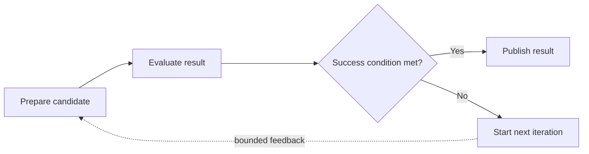
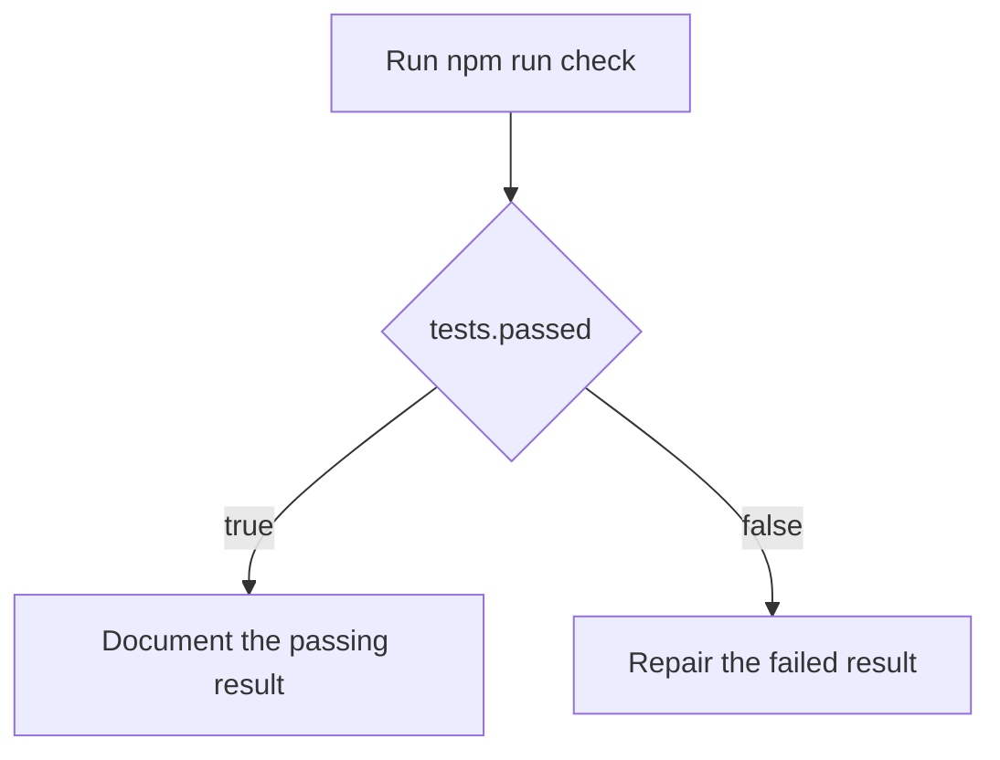

# Hypagraph

**Give your coding agent a plan it can execute, inspect, and prove.**

Hypagraph is a graph-workflow extension for the [Pi coding agent](https://github.com/badlogic/pi-mono). It automatically turns an ordinary coding request or an existing plan into an explicit graph of tasks, checks, decisions, and bounded iteration regions.

Instead of relying on a long checklist and model memory, Hypagraph keeps the workflow state in Pi. It controls which work is ready, records evidence, runs deterministic commands, parses declared reports, evaluates file and Git assertions, selects branches from typed facts, and shows the live graph while the agent works. The user does not have to design the graph or use graph terminology.



## Why use Hypagraph?

Coding agents often start with a reasonable plan, then lose structure as the session grows. Hypagraph makes the plan executable.

- **See the work:** open a live graph pane inside Pi.
- **Control execution:** dependencies decide which nodes are ready.
- **Prove completion:** tasks require evidence and checks record their results.
- **Route from facts:** gates select branches from typed check output.
- **Run bounded iteration:** loop regions have typed success conditions, hard limits, optional progress metrics, patience, and explicit outcome policies.
- **Compose independent work:** a loop can connect to the wider graph or run as an independent top-level component.
- **Resume safely:** workflow state is stored in the Pi session and rebuilt without rerunning completed external effects.

Hypagraph is useful for repository changes that have dependencies, conditional paths, mandatory checks, or bounded repeated work.

## Install

Install Hypagraph directly from GitHub:

```bash
pi install git:github.com/Hypabolic/Hypagraph
```

Restart Pi after installation. Hypagraph loads its extension and bundled skill automatically.

Update an existing installation:

```bash
pi update git:github.com/Hypabolic/Hypagraph
```

Install it only for the current project with Pi's `-l` option:

```bash
pi install -l git:github.com/Hypabolic/Hypagraph
```

## Start your first workflow

Open Pi in a repository and describe what you want done in normal language. You do not need to mention Hypagraph, graphs, nodes, gates, facts, or loops.

For example:

```text
Move the remaining modules from the old parser to the new parser in safe batches.
Run compatibility checks after each batch. Stop when no old-parser imports remain,
then update the migration record.

Keep changes inside src/parser/** and tests/parser/**.
```

The bundled skill inspects the repository and compiles the request into the smallest useful Hypagraph workflow. It infers work contracts, dependencies, checks, branches, bounded iteration, evidence, and writable scopes before execution.

A small request stays small. Hypagraph can use one task and one check when that is sufficient. It does not add graph complexity that the work does not need.

You can also paste an issue, checklist, or existing implementation plan. The skill preserves its intent while converting sequence, dependencies, conditions, and repeated work into executable graph structure.

The skill asks about product intent only when it cannot infer a safe answer. It does not ask the user to design nodes or edges.

Open the live graph:

```text
/hypagraph graph
```

Show the current workflow:

```text
/hypagraph
```

Show detailed bounded-iteration status:

```text
/hypagraph loop
```

A typical run works like this:

1. The bundled skill compiles the user's request or plan into a workflow graph.
2. Hypagraph validates and stores the graph.
3. Dependency-free nodes and eligible loop entries become ready.
4. The agent completes tasks and submits evidence.
5. Checks publish typed facts from commands, reports, files, or repository state.
6. Gates select deterministic routes from those facts.
7. A loop evaluates its typed success condition at its declared boundary.
8. A false result can follow declared feedback and start another bounded iteration.
9. Progress and patience rules can stop an unproductive region before its hard limit.
10. Each failed region applies its declared workflow outcome policy.
11. The workflow completes only when its required graph components reach valid terminal results.

## Bounded iteration is generic

A loop is a first-class bounded iteration region. It is not a repair command and repair is not its default purpose.

The same model can represent:

- refinement and optimization;
- bounded batch processing;
- search and repeated evaluation;
- reconciliation and migration;
- polling with a hard stop;
- test-and-repair as one pattern among many.

Each region declares:

- an entry and evaluation boundary;
- typed success conditions;
- feedback edges;
- a mandatory maximum iteration count;
- an optional numeric progress metric and patience;
- a failure policy: `fail-workflow`, `block-dependants`, or `record-and-continue`.

Facts, attempts, routes, evidence, progress, and resets are scoped to the current loop and iteration. A disconnected loop appears as its own graph component and cannot reset or satisfy unrelated work.

## Example: check, route, and repair

Repair remains a useful example, but it is not a special loop type.

The repository includes a complete [command-check gate example](examples/command-check-gate.json). It models this workflow:



The command check runs without a shell by default, has a timeout, captures bounded output, and publishes facts from its result. The gate reads those facts and persists the selected route.

Ask Pi to load or adapt the example:

```text
Use examples/command-check-gate.json as the basis for a Hypagraph workflow for this repository. Adapt the command, file scopes, and acceptance criteria before you start execution.
```

## Working with the graph pane

| Command | Action |
| --- | --- |
| `/hypagraph` | Show the active workflow state. |
| `/hypagraph loop` | Show canonical loop state, progress, outcome policy, and exit details. |
| `/hypagraph graph` | Open or focus the live graph pane. |
| `/hypagraph graph toggle` | Open or close the graph pane. |
| `/hypagraph graph focus` | Give keyboard focus to the pane. |
| `/hypagraph graph close` | Close the pane. |
| `/hypagraph check active` | Show the active deterministic check. |
| `/hypagraph check cancel [node-id]` | Cancel an active check. |

Graph pane controls:

| Key | Action |
| --- | --- |
| Arrow keys or `h`, `j`, `k`, `l` | Move between nodes. |
| Enter | Show details for the selected node. |
| Home | Select the active node. |
| `r` | Select the ready frontier. |
| `+` or `-` | Change graph density. |
| Escape | Release focus on a wide terminal. |
| `q` | Close the pane. |

On wide terminals, Hypagraph uses a passive right-side pane. On narrow terminals, it opens a full-screen graph view. The pane is read-only and cannot select a loop decision.

## What a workflow can contain

### Tasks

A task describes agent work. It can define acceptance criteria, required evidence, dependencies, and allowed file paths.

### Command checks

A command check runs a deterministic local command such as `npm run check`. It supports timeouts, cancellation, bounded output, explicit retry policy, environment-variable allowlists, and result artifacts.

### Report checks

A report check runs a bounded producer command and parses one declared report with a versioned deterministic adapter. Supported formats are:

- Vitest JSON test reports;
- ESLint JSON reports;
- Istanbul coverage summaries.

Report paths must remain inside the workspace. Reads are bounded, raw reports are retained as evidence, and malformed reports cannot publish facts.

### File assertions

A file assertion checks one workspace-contained path. It can verify existence, absence, exact size, SHA-256, or bounded text content.

### Git assertions

A Git assertion uses a fixed command allowlist. It can verify clean state, the current branch, the current revision, or an exact or containing set of changed paths. Workflow definitions cannot provide arbitrary Git arguments.

### Gates

A gate evaluates a typed condition against facts produced by earlier nodes. It selects and persists one route while skipping the other route.

### Bounded iteration regions

A loop declares feedback, an iteration region, a typed success condition, and a hard iteration limit. It can connect to the main graph or form an independent graph component.

## Check facts

Every check declares the facts it can publish. Hypagraph validates the names and types before execution.

Public parser and assertion facts:

- use a declared namespace;
- use lowercase dotted paths;
- use kebab-case for multiword segments;
- retain evidence references;
- cannot overwrite facts owned by another node.

Examples include `tests.success`, `lint.files.with-errors`, `coverage.lines.percent`, `artifact.size-bytes`, and `repository.changed-paths`.

A valid assertion that evaluates to false is a failed check. Invalid input or an evaluator failure is an error. This distinction is visible in Pi and in the durable attempt record.

## Session safety and recovery

Hypagraph stores accepted event batches in the Pi session. The event stream is the source of truth, and the current workflow is a deterministic projection of those events.

A deterministic check is stored in this order:

```text
store check start
    |
    v
run bounded command or assertion
    |
    v
store raw result and evidence
    |
    v
publish declared facts
    |
    v
store verification and loop decision
```

Hypagraph does not start an external check effect when it cannot first store the check start. Session restore does not rerun a completed command or repeat a completed assertion read. It closes an interrupted attempt or resumes verification from a stored raw result. Loop decisions and next-iteration resets are committed atomically.

Check artifacts are stored under `.hypagraph/check-artifacts`. Hypagraph stores references in the event stream instead of storing large command output or reports in the Pi session.

## Current status

The current implementation includes:

- installable Pi integration and a bundled automatic graph-authoring skill;
- task, gate, command-check, report-check, file-assertion, and Git-assertion nodes;
- a live terminal graph pane;
- typed facts and deterministic route selection;
- durable event-based workflow state;
- bounded commands with timeout, cancellation, retry policy, environment allowlists, and artifact capture;
- versioned Vitest, ESLint, and Istanbul report adapters;
- workspace-contained file assertions and fixed-allowlist Git assertions;
- generic bounded iteration regions with deterministic feedback;
- hard limits, numeric progress, best-result tracking, and patience;
- independent loop components and explicit failure policies;
- revision invalidation, cancellation blocking, restore recovery, and stale-result rejection;
- canonical loop summaries and graph-pane loop state;
- deterministic replay, migration, recovery, and cross-platform dogfood tests.

The v0.5 release evidence covers refinement and optimization, bounded processing, check-and-repair, disconnected regions, every failure policy, cancellation, restore, hard-limit and patience exhaustion, and stale-result rejection. See the [v0.5 dogfood record](docs/v0.5-dogfood.md).

The M3.1 evidence runs test, lint, coverage, file, and Git checks in one durable workflow and verifies persisted replay. See the [M3.1 implementation record](docs/m3-1-parser-adapters-plan.md).

## Develop locally

Development requires Node.js 22 or later.

```bash
git clone https://github.com/Hypabolic/Hypagraph.git
cd Hypagraph
npm install
npm run check
pi -e ./extensions/hypagraph.ts
```

The hosted test matrix runs on Ubuntu, macOS, and Windows with Node.js 22 and 24.

## Documentation

- [Product and technical specification](docs/product-spec.md)
- [Automatic graph authoring model](docs/automatic-graph-authoring.md)
- [M3.1 deterministic parser adapters](docs/m3-1-parser-adapters-plan.md)
