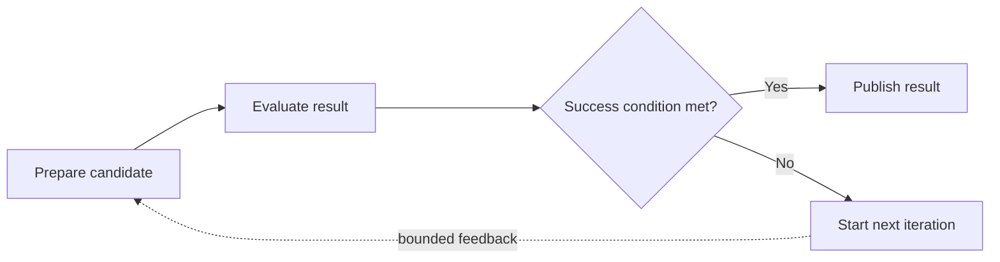
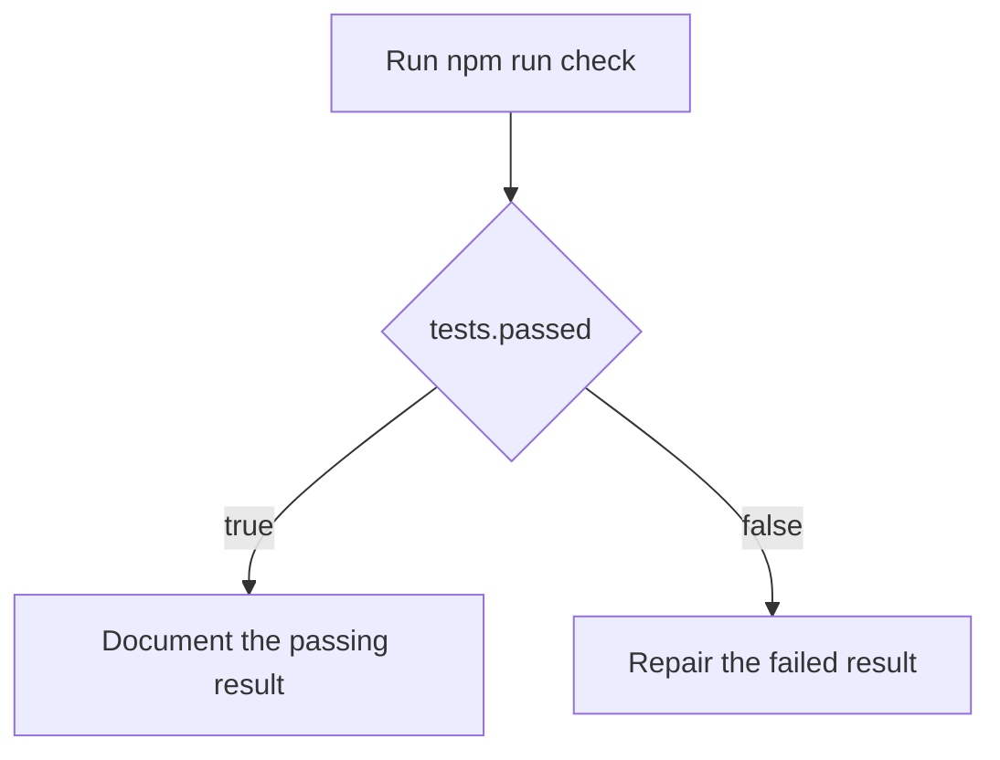

# Hypagraph

**Give your coding agent a plan it can execute, inspect, and prove.**

Hypagraph is a graph workflow extension for the [Pi coding agent](https://github.com/badlogic/pi-mono). It turns a coding plan into an explicit graph of tasks, checks, decisions, and bounded iteration regions.

Instead of relying on a long checklist and model memory, Hypagraph keeps the workflow state in Pi. It controls which work is ready, records evidence, runs deterministic checks, selects branches from typed facts, and shows the live graph while the agent works.



## Why use Hypagraph?

Coding agents often start with a reasonable plan, then lose structure as the session grows. Hypagraph makes the plan executable.

- **See the work:** open a live graph pane inside Pi.
- **Control execution:** dependencies decide which nodes are ready.
- **Prove completion:** tasks require evidence and checks record their results.
- **Route from facts:** gates select branches from typed check output.
- **Run bounded iteration:** declared loop regions have typed success conditions, hard limits, and optional progress and patience rules.
- **Resume safely:** workflow state is stored in the Pi session and rebuilt on restore.

Hypagraph is useful for repository changes that have dependencies, conditional paths, mandatory checks, or bounded repeated work.

## Install

Install Hypagraph directly from GitHub:

```bash
pi install git:github.com/Hypabolic/Hypagraph
```

Restart Pi after installation. Hypagraph loads its extension and bundled skill automatically.

Update an existing installation:

```bash
pi update git:github.com/Hypabolic/Hypagraph
```

Install it only for the current project with Pi's `-l` option:

```bash
pi install -l git:github.com/Hypabolic/Hypagraph
```

## Start your first workflow

Open Pi in a repository and describe the work as a graph. You do not need to write the graph JSON yourself.

For example:

```text
Create a Hypagraph workflow for this migration:

1. Inspect the modules that still use the old parser.
2. Migrate one bounded batch of modules.
3. Run compatibility checks and publish migration.remaining.
4. Continue the batch loop until migration.remaining is zero.
5. Update the migration record.

Limit the batch loop to six iterations. Keep changes inside src/parser/** and tests/parser/**.
```

The agent can define the workflow with Hypagraph, then execute only the nodes that are ready.

Open the live graph:

```text
/hypagraph graph
```

Show a compact workflow summary:

```text
/hypagraph
```

A typical run looks like this:

1. Hypagraph validates and stores the graph.
2. The first dependency-free nodes, including eligible loop entries, become ready.
3. The agent completes a task and submits evidence.
4. Checks or task nodes publish typed facts.
5. Gates select deterministic routes from those facts.
6. A loop evaluates its typed success condition at its declared boundary.
7. A false result can follow declared feedback and start another bounded iteration.
8. The workflow completes only when its required graph components reach a valid terminal result.

## Example: check, route, and repair

Repair is one common use of an iteration region. It is not a special loop type.

The repository includes a complete [command-check gate example](examples/command-check-gate.json). It models this workflow:



The command check runs without a shell by default, has a timeout, captures bounded output, and publishes facts from its result. The gate reads those facts and persists the selected route.

Ask Pi to load or adapt the example:

```text
Use examples/command-check-gate.json as the basis for a Hypagraph workflow for this repository. Adapt the command, file scopes, and acceptance criteria before you start execution.
```

## Working with the graph pane

Use these commands inside Pi:

| Command | Action |
| --- | --- |
| `/hypagraph` | Show the active workflow state. |
| `/hypagraph graph` | Open or focus the live graph pane. |
| `/hypagraph graph toggle` | Open or close the graph pane. |
| `/hypagraph graph focus` | Give keyboard focus to the pane. |
| `/hypagraph graph close` | Close the graph pane. |
| `/hypagraph check active` | Show the active command check. |
| `/hypagraph check cancel [node-id]` | Cancel an active command check. |

Graph pane controls:

| Key | Action |
| --- | --- |
| Arrow keys or `h`, `j`, `k`, `l` | Move between nodes. |
| Enter | Show details for the selected node. |
| Home | Select the active node. |
| `r` | Select the ready frontier. |
| `+` or `-` | Change graph density. |
| Escape | Release focus on a wide terminal. |
| `q` | Close the pane. |

On wide terminals, Hypagraph uses a passive right-side pane. On narrow terminals, it opens a full-screen graph view.

## What a workflow can contain

### Tasks

A task describes agent work. It can define acceptance criteria, required evidence, dependencies, and allowed file paths.

### Command checks

A command check runs a deterministic local command such as `npm run check`. It supports timeouts, cancellation, bounded output, explicit retry policy, environment-variable allowlists, and result artifacts.

### Gates

A gate evaluates a typed condition against facts produced by earlier nodes. It selects and persists one route while skipping the other route.

### Bounded iteration regions

A loop declares feedback, an iteration region, a typed success condition, and a hard iteration limit. It can model refinement, optimization, search, batch processing, repeated evaluation, reconciliation, polling, or test-and-repair work. A loop can connect to the main graph or form an independent graph component.

## Session safety and recovery

Hypagraph stores accepted event batches in the Pi session. The event stream is the source of truth, and the current workflow is a deterministic projection of those events.

A command check is stored in this order:

```text
store check start
    |
    v
run command
    |
    v
store facts
    |
    v
store raw result
    |
    v
store verification result
```

Hypagraph does not run a command when it cannot first store the check start. Session restore does not rerun a completed command. It closes an interrupted attempt or resumes verification from a stored raw result.

Check output artifacts are stored under `.hypagraph/check-artifacts`. Hypagraph stores references in the event stream instead of storing large command output in the Pi session.

## Current status

Hypagraph v0.4 includes:

- installable Pi integration and a bundled skill;
- task, gate, and command-check nodes;
- a live terminal graph pane;
- typed facts and deterministic route selection;
- durable event-based workflow state;
- command checks with timeout, cancellation, retry policy, and artifact capture;
- branch-aware joins and graph revision invalidation;
- declared bounded loops and loop feedback rendering;
- deterministic replay, migration, recovery, and property tests.

The v0.4 release was dogfooded through the real Pi product path with a graph that included a command check, a gate, selected and skipped routes, a join, and a declared feedback loop. See the [v0.4 dogfood record](docs/v0.4-dogfood.md).

M4 is in progress. Slices 1 to 6 provide generic bounded iteration regions, independent graph components, explicit failure policies, hard iteration limits, numeric progress, best-result tracking, and patience failure. Later slices add recovery hardening and the complete Pi loop surface.

## Develop locally

Development requires Node.js 22 or later.

```bash
git clone https://github.com/Hypabolic/Hypagraph.git
cd Hypagraph
npm install
npm run check
pi -e ./extensions/hypagraph.ts
```

The hosted test matrix runs on Ubuntu, macOS, and Windows with Node.js 22 and 24.

## Documentation

- [Product and technical specification](docs/product-spec.md)
- [Execution plan and roadmap](docs/execution-roadmap.md)
- [Loop-region product model](docs/loop-region-product-model.md)
- [M4 executable bounded iteration regions plan](docs/m4-vertical-slice-plan.md)
- [Trusted evaluation contracts and loss functions](docs/trusted-evaluation-contract-plan.md)
- [Hypagoal plan](docs/hypagoal-vertical-slice-plan.md)
- [Durable lifecycle and Pi session storage](docs/durable-lifecycle-storage.md)
- [Check execution policy](docs/check-execution-policy.md)
- [Pi graph visualisation plan](docs/pi-graph-visualisation-plan.md)
- [v0.4 dogfood record](docs/v0.4-dogfood.md)
- [Release notes](CHANGELOG.md)

## Repository writing rules

Repository text uses the ASD-STE100 Simplified Technical English method. See [AGENTS.md](AGENTS.md) for the mandatory rules.
