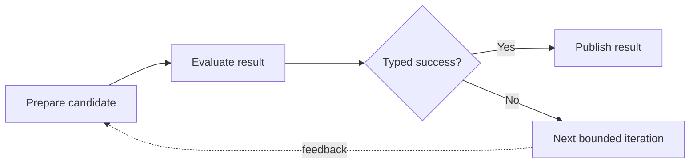

# Hypagraph

**Give your coding agent a plan it can execute, inspect, and prove.**

Hypagraph is a graph-workflow extension for the [Pi coding agent](https://github.com/badlogic/pi-mono). It turns an ordinary coding request or an existing implementation plan into an explicit workflow of tasks, checks, decisions, and bounded iteration regions.

You describe the work. Hypagraph builds and runs the graph.

It keeps canonical workflow state in Pi, controls which work is ready, records evidence, runs deterministic checks, parses declared reports, evaluates typed gates, tracks bounded iteration, and shows the live graph while the agent works.



## Why use Hypagraph?

Coding agents often begin with a reasonable plan and lose structure as the session grows. Hypagraph makes the plan executable.

- **Automatic authoring:** ordinary requests and supplied plans become the smallest useful graph.
- **Graph-backed goals:** `/hypagoal` atomically creates one root goal and its canonical workflow from ordinary prose.
- **Dependency control:** only ready work can start.
- **Evidence-backed completion:** task results and checks remain attached to durable attempts.
- **Typed routing:** gates select branches from declared facts.
- **Bounded iteration:** regions have typed success, hard limits, optional progress metrics, patience, and explicit outcome policy.
- **Trusted evaluation:** metric reports can declare validity, feedback limits, evaluation budgets, trust, and evaluator integrity.
- **Independent components:** disconnected loop regions keep independent state.
- **Safe recovery:** session state restores without repeating completed external effects.
- **Live inspection:** Pi shows workflow, goal-control, loop, check, and evaluator state.

## Install

Install directly from GitHub:

```bash
pi install git:github.com/Hypabolic/Hypagraph
```

Restart Pi after installation. Hypagraph loads its extension and bundled skill automatically.

Update an existing installation:

```bash
pi update git:github.com/Hypabolic/Hypagraph
```

Install only for the current project:

```bash
pi install -l git:github.com/Hypabolic/Hypagraph
```

## Start a Hypagoal

Open Pi in a repository and enter an ordinary prose objective:

```text
/hypagoal Add an inspect command that reports the current workflow without starting execution.
```

Hypagraph then:

1. preserves the objective exactly;
2. inspects relevant repository context;
3. compiles the smallest useful canonical workflow;
4. validates the complete definition;
5. creates the workflow, initial readiness, and workflow-local goal lifecycle in one durable event batch;
6. reports the workflow ID, goal ID, revision, goal-control state, ready work, and authoring advisories.

Creation does not start a task, run a check, invoke an executor, or queue autonomous continuation. Graph-aware continuation is a separate lifecycle operation.

The current v0.6 product surface allows one root workflow and one root goal in the active Pi session. Replacing that root requires explicit confirmation bound to the exact current workflow, goal, revision, sequence, snapshot hash, session generation, and branch generation. The workflow domain itself remains able to represent separate workflow aggregates for the later goal-family architecture.

## Start a workflow

Open Pi in a repository and describe the work in normal language.

```text
Move the remaining modules from the old parser to the new parser in safe batches.
Run compatibility checks after each batch. Stop when no old-parser imports remain,
then update the migration record.

Keep changes inside src/parser/** and tests/parser/**.
```

The bundled skill:

1. inspects the repository;
2. identifies the requested result and constraints;
3. finds relevant files and checks;
4. compiles the request into the smallest correct Hypagraph workflow;
5. validates the graph before execution;
6. runs only ready work;
7. revises the graph when new evidence makes the current plan incorrect.

A small request stays small. Hypagraph does not create a gate, loop, or extra node unless the work needs it.

You can also paste an issue, checklist, or implementation plan. Hypagraph preserves the intent while converting sequence, dependencies, conditions, checks, and repeated work into executable graph structure.

## Pi commands

| Command | Action |
| --- | --- |
| `/hypagoal <objective>` | Inspect repository context and atomically create one root graph-backed goal. |
| `/hypagraph` | Show the active workflow. |
| `/hypagraph loop` | Show canonical loop, progress, evaluation, and outcome state. |
| `/hypagraph graph` | Open or focus the live graph pane. |
| `/hypagraph graph toggle` | Open or close the graph pane. |
| `/hypagraph graph focus` | Focus the graph pane. |
| `/hypagraph graph close` | Close the graph pane. |
| `/hypagraph check active` | Show the active deterministic check. |
| `/hypagraph check cancel [node-id]` | Cancel an active check. |

Graph pane controls:

| Key | Action |
| --- | --- |
| Arrow keys or `h`, `j`, `k`, `l` | Move between nodes. |
| Enter | Show selected-node details. |
| Home | Select the active node. |
| `r` | Select the ready frontier. |
| `+` or `-` | Change graph density. |
| Escape | Release focus on a wide terminal. |
| `q` | Close the pane. |

## What a workflow can contain

### Tasks

A task describes bounded agent work. It can declare acceptance criteria, required evidence, dependencies, and writable paths.

### Command checks

A command check runs a deterministic local command without a shell. It supports timeouts, cancellation, bounded output, retry policy, environment allowlists, artifacts, and typed result facts.

### Report checks

Report checks run a bounded producer command and parse one declared report through a versioned deterministic adapter.

Supported report formats include:

- Vitest JSON;
- ESLint JSON;
- Istanbul coverage summaries;
- scalar metric JSON.

Report paths remain inside the workspace. Reads are bounded. Malformed reports cannot publish facts.

### File assertions

A file assertion can verify:

- existence or absence;
- exact size;
- SHA-256;
- bounded text content.

Protected evaluator file instruments reject symbolic links, use bounded descriptor reads, and verify the opened file identity before accepting content.

### Git assertions

A Git assertion uses a fixed command and argument allowlist. It can verify:

- clean state;
- current branch;
- current revision;
- exact revision;
- changed-path sets;
- protected paths unchanged from an exact base revision.

Workflow definitions cannot supply arbitrary Git arguments.

### Gates

A gate evaluates a typed condition against facts produced by earlier nodes. It persists one selected route and skips the other route.

### Bounded iteration regions

A loop is a first-class bounded iteration region. It is not a repair command and repair is not its default purpose.

The same model can represent:

- refinement and optimization;
- bounded batch processing;
- search and repeated evaluation;
- reconciliation and migration;
- polling with a hard stop;
- check-and-repair as one pattern among many.

Each region declares:

- entry and evaluation boundaries;
- typed success;
- feedback edges;
- a hard iteration limit;
- optional numeric progress and patience;
- optional evaluation validity;
- explicit failure policy: `fail-workflow`, `block-dependants`, or `record-and-continue`.

A loop can connect to the wider graph or run as a disconnected top-level component. Its facts, attempts, routes, progress, validity, and resets remain independent from unrelated regions.

## Trusted evaluation contracts

A numeric score is not automatically a trustworthy measure of progress.

Hypagraph keeps these concepts separate:

- **success:** may the region complete?
- **progress:** is this valid result better than the prior best result?
- **validity:** may the runtime use this observation?
- **purpose:** is this development, probe, or holdout evaluation?
- **trust:** is the evaluator transparent, protected, or isolated?

A metric evaluator can declare:

- scalar mappings into typed facts;
- aggregate or bounded-diagnostic feedback;
- total and per-purpose evaluation budgets;
- typed validity;
- protected file and Git instruments;
- evaluator version and fingerprint;
- transparent or protected trust.

An invalid result remains available for audit but cannot:

- complete the loop;
- update the accepted metric;
- replace the best result;
- change patience.

Evaluation budget is consumed when the external evaluator starts. Failed, invalid, timed-out, cancelled, interrupted, errored, and retried attempts count.

Protected evaluator output is not exposed in normal Pi messages. Protected local evaluation proves declared artifact integrity; it does not hide readable answers. Production isolated evaluation remains planned.

## Session safety and recovery

Hypagraph stores accepted event batches in the Pi session. The event stream is the source of truth, and the current workflow is a deterministic projection.

A root Hypagoal creation is stored in this order:

```text
workflow defined
    |
    v
initial ready nodes
    |
    v
goal started
    |
    v
one durable append
```

The active Pi state changes only after the complete creation append succeeds. Failed validation, sequence conflicts, branch changes, stale replacement confirmation, or snapshot mismatch expose no partial candidate state.

A deterministic check is stored in this order:

```text
store check start
    |
    v
run bounded external effect
    |
    v
store raw result and evidence
    |
    v
publish declared facts
    |
    v
store verification and loop decision
```

Hypagraph does not start an external check when it cannot first store the check-start event.

Restore rebuilds canonical state only. It does not queue a continuation, dispatch model work, invoke an executor, or rerun completed commands, reports, assertions, or integrity checks. It closes interrupted attempts or resumes verification from stored observations.

Check artifacts are stored under `.hypagraph/check-artifacts`. Large output stays outside the Pi event stream and is referenced by artifact identity.

## Current status

Implemented:

- automatic graph authoring skill;
- atomic root `/hypagoal` creation and `hypagoal_start` model surface;
- workflow-local goal lifecycle and workflow-derived terminal state;
- task, check, and gate nodes;
- live terminal graph pane;
- typed facts and deterministic routes;
- durable event-based state and replay;
- command, report, metric, file, and Git checks;
- cancellation, retry, restore, and stale-result protection;
- generic bounded iteration regions;
- numeric progress, best-result tracking, and patience;
- independent loop components and explicit failure policies;
- evaluation validity and invalid-observation limits;
- protected feedback and event-backed evaluation budgets;
- evaluator purpose, trust, integrity, version, and fingerprint surfaces.

Next:

- graph-aware Hypagoal continuation across all runnable root components;
- automatic evaluation-contract authoring;
- transport-neutral evaluator adapters;
- evaluation dogfood and M5A closeout;
- delegated and ACP execution.

## Develop locally

Development requires Node.js 22 or later.

```bash
git clone https://github.com/Hypabolic/Hypagraph.git
cd Hypagraph
npm install
npm run check
pi -e ./extensions/hypagraph.ts
```

CI runs on Ubuntu, macOS, and Windows with Node.js 22 and 24.

## Documentation

- [Product and technical specification](docs/product-spec.md)
- [Automatic graph authoring model](docs/automatic-graph-authoring.md)
- [Trusted evaluation contracts](docs/trusted-evaluation-contract-plan.md)
- [Hypagoal vertical slices](docs/hypagoal-vertical-slice-plan.md)
- [Goal-family and concurrent-execution architecture](docs/goal-family-and-concurrent-execution-plan.md)
- [Current session handoff](docs/session-handoff.md)
- [M3.1 deterministic parser adapters](docs/m3-1-parser-adapters-plan.md)
- [M4 bounded iteration plan](docs/m4-vertical-slice-plan.md)
- [v0.5 dogfood record](docs/v0.5-dogfood.md)
