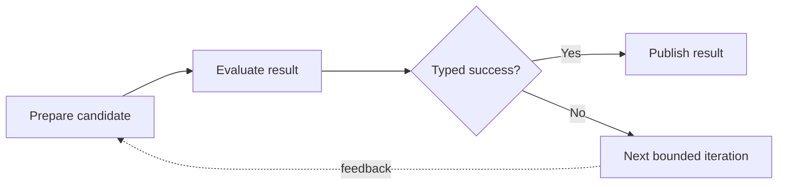

# Hypagraph

**Give your coding agent a plan it can execute, inspect, and prove.**

Hypagraph is a graph-workflow extension for the [Pi coding agent](https://github.com/badlogic/pi-mono). It turns an ordinary coding request or an existing implementation plan into an explicit workflow of tasks, checks, decisions, and bounded iteration regions.

You describe the work. Hypagraph builds and runs the graph.

It keeps canonical workflow state in Pi, controls which work is ready, records evidence, runs deterministic checks, parses declared reports, evaluates typed gates, tracks bounded iteration, and shows the live graph while the agent works.


```mermaid
flowchart LR
    A[Prepare candidate] --> B[Evaluate result]
    B --> C{Typed success?}
    C -- Yes --> D[Publish result]
    C -- No --> E[Next bounded iteration]
    E -. feedback .-> A
```

## Why use Hypagraph?

Coding agents often begin with a reasonable plan and lose structure as the session grows. Hypagraph makes the plan executable.

- **Automatic authoring:** ordinary requests and supplied plans become the smallest useful graph.
- **Graph-backed goals:** `/hypagoal` atomically creates one root goal and its canonical workflow from ordinary prose.
- **Dependency control:** only ready work can start.
- **Evidence-backed completion:** task results and checks remain attached to durable attempts.
- **Typed routing:** gates select branches from declared facts.
- **Bounded iteration:** regions have typed success, hard limits, optional progress metrics, patience, and explicit outcome policy.
- **Trusted evaluation:** metric reports can declare validity, feedback limits, evaluation budgets, trust, and evaluator integrity.
- **Independent components:** disconnected loop regions keep independent state.
- **Safe recovery:** session state restores without repeating completed external effects.
- **Live inspection:** Pi shows workflow, goal-control, loop, check, and evaluator state.

## Install

Install directly from GitHub:

```bash
pi install git:github.com/Hypabolic/Hypagraph
```

Restart Pi after installation. Hypagraph loads its extension and bundled skill automatically.

Update an existing installation:

```bash
pi update git:github.com/Hypabolic/Hypagraph
```

Install only for the current project:

```bash
pi install -l git:github.com/Hypabolic/Hypagraph
```

## Start a Hypagoal

Open Pi in a repository and enter an ordinary prose objective:

```text
/hypagoal Add an inspect command that reports the current workflow without starting execution.
```

You can also type the configured trigger word (default `hypagoal`) as a whole token in an ordinary message. In interactive TUI, that token highlights in the composer before you submit. Highlight and submit arming use the same matcher. Arming does not create a goal by itself. The model may call `hypagoal_start` when the request needs a graph.

Hypagraph then:

1. preserves the objective exactly;
2. inspects relevant repository context;
3. compiles the smallest useful canonical workflow;
4. validates the complete definition;
5. creates the workflow, initial readiness, and workflow-local goal lifecycle in one durable event batch;
6. reports the workflow ID, goal ID, revision, goal-control state, ready work, and authoring advisories.

The atomic creation operation does not start a task, run a check, or invoke an executor.

In interactive TUI, Hypagraph then presents a bottom post-create dock with a Mermaid diagram of the new graph and three actions: **Run**, **Question**, and **Cancel**. Autonomous work starts only when the user chooses Run. Question keeps the goal active so the user can ask about the graph; Esc dismisses like Question. Cancel cancels the goal. After Question (or after reload while no node has started), `/hypagraph resume` re-opens the post-create dock. It does not auto-start work. The user must choose Run on the dock again. Headless hosts do not show the dock and may auto-continue after create.

When the user chooses Run (or headless auto-continue applies), the graph-aware controller selects one canonical action and dispatches it in one lane.

Hypagraph uses one generic action-dispatch model. Every selected action records a selected event, a dispatched event, and one terminal event. A model-lane action stores one state-bound continuation request and sends one Pi follow-up. A deterministic-lane action needs no reasoning, so the controller runs it directly: a ready gate is one reducer command, and a ready check runs through the existing durable check lifecycle. The controller selects again after the deterministic action resolves.

The current product surface (package version 0.14) allows one root workflow and one root goal in the active Pi session for the ordinary create path. Replacing that root requires explicit confirmation bound to the exact current workflow, goal, revision, sequence, snapshot hash, session generation, and branch generation. The workflow domain also represents goal families, isolated model executors, worktrees, and concurrent scheduling for deeper product paths.

The controller selects from all runnable root components in stable definition order. An event-backed scheduler ordinal rotates selection when multiple components remain runnable. The scheduler ordinal advances for every selected action in every lane, so round-robin fairness does not depend on model usage. A disconnected branch or independent loop does not lose eligibility because another component produced the latest event. Each queued follow-up is bound to the goal, workflow, revision, sequence, snapshot hash, session generation, branch generation, node, and loop where applicable. A stale follow-up cannot change canonical state.

A Hypagoal can also declare a maximum substantive-turn count, a maximum token count, or both. Pi assistant usage is normalized from input, output, cache-read, and cache-write tokens. Each delivered model-lane continuation is charged once through a durable turn event before another model-lane action can be dispatched. Budget exhaustion stops autonomous continuation as `budget_limited`; it does not mark the workflow successful.

Consumed turns count model turns only. A deterministic action consumes no turn. `/hypagraph status` reports the scheduled action count next to the charged model-turn count and states this rule, so a user who compares node count with turn count does not think that work is missing. A turn-budget stop ends automatic continuation in every lane.

Deterministic work still has a bound. Loop iteration limits, patience, evaluation budgets, and check retry limits remain unchanged, and the controller stops after 64 consecutive deterministic dispatches in one pass.

When the selected action belongs to a bounded iteration region, the continuation includes canonical loop and evaluation context. It reports the current iteration, typed success condition, current and best accepted metrics, progress direction, patience, invalid-evaluation count, evaluation-attempt budget, purpose, trust, feedback mode, and failure policy when these values exist. It does not expose protected evaluator commands, paths, hashes, raw reports, standard output, standard error, hidden assertions, or holdout details.

Evaluation validity, numeric progress, and typed success remain separate. An invalid evaluation cannot update the best metric or satisfy success. The same root selector continues to rotate across disconnected branches and independent loop components. A loop does not own the next turn because it produced the latest event.

A session reload or branch change clears any queued continuation and persists a paused goal without dispatching work. Restore also closes a deterministic dispatch which a stopped host left pending, so a lost dispatch cannot block a later selection. Review canonical state and use `/hypagraph resume` to continue. Resume re-checks the current budget and runnable graph before it queues another state-bound follow-up.

## Start a workflow

Open Pi in a repository and describe the work in normal language.

```text
Move the remaining modules from the old parser to the new parser in safe batches.
Run compatibility checks after each batch. Stop when no old-parser imports remain,
then update the migration record.

Keep changes inside src/parser/** and tests/parser/**.
```

The bundled skill:

1. inspects the repository;
2. identifies the requested result and constraints;
3. finds relevant files and checks;
4. compiles the request into the smallest correct Hypagraph workflow;
5. validates the graph before execution;
6. runs only ready work;
7. revises the graph when new evidence makes the current plan incorrect.

A small request stays small. Hypagraph does not create a gate, loop, or extra node unless the work needs it.

You can also paste an issue, checklist, or implementation plan. Hypagraph preserves the intent while converting sequence, dependencies, conditions, checks, and repeated work into executable graph structure.

## Pi commands

`/hypagraph` is the preferred control and inspection surface. `/hypagoal <objective>` remains the explicit create command. Compatibility control subcommands on `/hypagoal` still work; prefer `/hypagraph` for status, pause, resume, cancel, and graph.

| Command | Action |
| --- | --- |
| `/hypagoal <objective>` | Inspect repository context and atomically create one root graph-backed goal. |
| `/hypagraph` | Show the active workflow. |
| `/hypagraph status` | Show the exact objective, workflow phase, goal state, active or next work, budgets, loops, evaluations, blockage, revision state, and stop reason. |
| `/hypagraph pause [reason]` | Pause the root goal through the canonical lifecycle. |
| `/hypagraph resume` | Resume a paused or recoverable blocked goal after budget and runnable-path validation. |
| `/hypagraph cancel [reason]` | Cancel the root goal without implying success. |
| `/hypagraph ask [<node-id>]` | Present an open interaction question again. |
| `/hypagraph loop` | Show canonical loop, progress, evaluation, and outcome state. |
| `/hypagraph graph` | Open or focus the live graph pane. |
| `/hypagraph graph toggle` | Open or close the graph pane. |
| `/hypagraph graph focus` | Focus the graph pane. |
| `/hypagraph graph close` | Close the graph pane. |
| `/hypagraph check active` | Show the active deterministic check. |
| `/hypagraph check cancel [node-id]` | Cancel an active check. |
| `/hypagraph history` | Show the most recent page of the event timeline. |
| `/hypagraph history <sequence>` | Replay canonical state to one stored sequence and compare it with live state. |
| `/hypagraph history <lane>` | Show one timeline lane. A lane is workflow, goal, dispatch, node, check, evaluation, fact, route, loop, or unknown. |
| `/hypagraph history revisions` | Show revision segments and discarded results. |
| `/hypagraph explain` | Explain the goal decision and every node. |
| `/hypagraph explain <node-id>` | Explain why one node is or is not runnable. |
| `/hypagraph trigger` | Show the Hypagoal arming trigger word. |
| `/hypagraph trigger set <word>` | Set the arming trigger word. The word highlights in the interactive composer while you type. |
| `/hypagraph trigger off` | Disable message arming and live composer highlight. |

Graph pane controls:

| Key | Action |
| --- | --- |
| Arrow keys or `h`, `j`, `k`, `l` | Move between nodes. |
| Enter | Show selected-node details. |
| Home | Select the active node. |
| `r` | Select the ready frontier. |
| `+` or `-` | Change graph density. |
| Escape | Release focus on a wide terminal. |
| `q` | Close the pane. |

## What a workflow can contain

### Tasks

A task describes bounded agent work. It can declare acceptance criteria, required evidence, dependencies, and writable paths.

### Command checks

A command check runs a deterministic local command without a shell. It supports timeouts, cancellation, bounded output, retry policy, environment allowlists, artifacts, and typed result facts.

### Report checks

Report checks run a bounded producer command and parse one declared report through a versioned deterministic adapter.

Supported report formats include:

- Vitest JSON;
- ESLint JSON;
- Istanbul coverage summaries;
- scalar metric JSON.

Report paths remain inside the workspace. Reads are bounded. Malformed reports cannot publish facts.

### File assertions

A file assertion can verify:

- existence or absence;
- exact size;
- SHA-256;
- bounded text content.

Protected evaluator file instruments reject symbolic links, use bounded descriptor reads, and verify the opened file identity before accepting content.

### Git assertions

A Git assertion uses a fixed command and argument allowlist. It can verify:

- clean state;
- current branch;
- current revision;
- exact revision;
- changed-path sets;
- protected paths unchanged from an exact base revision.

Workflow definitions cannot supply arbitrary Git arguments.

### Gates

A gate evaluates a typed condition against facts produced by earlier nodes. It persists one selected route and skips the other route.

### Bounded iteration regions

A loop is a first-class bounded iteration region. It is not a repair command and repair is not its default purpose.

The same model can represent:

- refinement and optimization;
- bounded batch processing;
- search and repeated evaluation;
- reconciliation and migration;
- polling with a hard stop;
- check-and-repair as one pattern among many.

Each region declares:

- entry and evaluation boundaries;
- typed success;
- feedback edges;
- a hard iteration limit;
- optional numeric progress and patience;
- optional evaluation validity;
- explicit failure policy: `fail-workflow`, `block-dependants`, or `record-and-continue`.

A loop can connect to the wider graph or run as a disconnected top-level component. Its facts, attempts, routes, progress, validity, and resets remain independent from unrelated regions.

## Trusted evaluation contracts

A numeric score is not automatically a trustworthy measure of progress.

Hypagraph keeps these concepts separate:

- **success:** may the region complete?
- **progress:** is this valid result better than the prior best result?
- **validity:** may the runtime use this observation?
- **purpose:** is this development, probe, or holdout evaluation?
- **trust:** is the evaluator transparent, protected, or isolated?

A metric evaluator can declare:

- scalar mappings into typed facts;
- aggregate or bounded-diagnostic feedback;
- total and per-purpose evaluation budgets;
- typed validity;
- protected file and Git instruments;
- evaluator version and fingerprint;
- transparent or protected trust.

An invalid result remains available for audit but cannot:

- complete the loop;
- update the accepted metric;
- replace the best result;
- change patience.

Evaluation budget is consumed when the external evaluator starts. Failed, invalid, timed-out, cancelled, interrupted, errored, and retried attempts count.

Protected evaluator output is not exposed in normal Pi messages. Protected local evaluation proves declared artifact integrity; it does not hide readable answers. Production isolated evaluation remains planned.

## Session safety and recovery

Hypagraph stores accepted event batches in the Pi session. The event stream is the source of truth, and the current workflow is a deterministic projection.

A root Hypagoal creation is stored in this order:

```text
workflow defined
    |
    v
initial ready nodes
    |
    v
goal started
    |
    v
one durable append
```

The active Pi state changes only after the complete creation append succeeds. Failed validation, sequence conflicts, branch changes, stale replacement confirmation, or snapshot mismatch expose no partial candidate state.

A deterministic check is stored in this order:

```text
store check start
    |
    v
run bounded external effect
    |
    v
store raw result and evidence
    |
    v
publish declared facts
    |
    v
store verification and loop decision
```

Hypagraph does not start an external check when it cannot first store the check-start event.

Restore rebuilds canonical state only. It does not queue a continuation, dispatch model work, invoke an executor, or rerun completed commands, reports, assertions, or integrity checks. It closes interrupted attempts or resumes verification from stored observations. When an active Hypagoal is restored after a reload or branch change, Hypagraph persists an explicit pause and requires `/hypagraph resume` before another continuation.

Check artifacts are stored under `.hypagraph/check-artifacts`. Large output stays outside the Pi event stream and is referenced by artifact identity.

## Current status

Package version is **0.14.0**. The start-to-run product surface is code-complete for the ordinary path. Live TUI dogfood remains the acceptance bar before any release cut.

### Start-to-run product surface (code complete)

- arm with the configured trigger word and live composer highlight (same matcher as submit arming);
- draft constructors and recipes under `.hypagraph/` project store (task, check, require, loop, implement-verify recipe);
- free-form definition remains supported for interaction, gate, code, and effect nodes (constructors do not yet build those kinds);
- atomic root `/hypagoal` creation and `hypagoal_start` (prefer `draftId` when constructors cover the graph);
- post-create Mermaid bottom dock with **Run**, **Question**, and **Cancel** (Esc = Question);
- no auto-run after create in interactive TUI; headless may auto-continue;
- resume after Question or reload re-opens the dock when no node has started (does not auto-start);
- default model tasks run in isolated workers (`isolated-pi`); `current-session` is an explicit node opt-in only;
- no production environment override for legacy current-session routing;
- abortable root workers on cancel, restore, branch change, shutdown, and a 15-minute hard timeout;
- `/hypagraph status` reports post-create gate, definition-artifact write state, and root worker elapsed time;
- interaction presentation uses the bottom dock (not a center modal);
- shared mutating-tool policy blocks `write`, `edit`, and `bash` during authoring and while waiting for Run;
- project-store write failures notify the user; create still succeeds with runtime event authority.
- `hypagoal_create_child` creates a bounded child Hypagoal from an active parent task after Run;
- multi-member create-child parent must use `executorProfile.kind: "current-session"` (Option A); workers never create children;
- child plan-owner tasks default to `isolated-pi`; current-session is refused on non-root members until member delivery ships;
- family-aware controller selection dispatches work across members (sequential multi-member path);
- child terminal return applies binding policies on the product path; child success does not complete the parent task;
- `/hypagraph status` reports family members, bindings, child-wait, budget, focus, worker member goal id, and child definition-artifact write state;
- `/hypagraph graph member <goalId>` focuses the graph pane on a family member.

### Kernel and control plane (implemented)

- automatic graph authoring skill;
- workflow-local goal lifecycle and workflow-derived terminal state;
- graph-aware root continuation with deterministic component selection;
- state-bound continuation requests and stale-delivery rejection;
- durable substantive-turn and token accounting with deterministic budget stops;
- reload and branch-change pause with explicit `/hypagraph resume`;
- task, check, gate, code, effect, and interaction node kinds;
- live terminal graph pane, typed facts, durable event store, and replay;
- command, report, metric, file, and Git checks with cancellation and restore protection;
- bounded iteration regions, evaluation contracts, and protected feedback;
- generic action-dispatch model (deterministic, model, and executor lanes);
- goal-family projection, bounded child create/return domain helpers, isolated Pi / ACP / CLI executor adapters, worktree integration, and bounded concurrency seams;
- `/hypagraph` status, pause, resume, cancel, history, explain, loop, check, graph, trigger, and executor controls.

### Next (not a v0.14 claim)

- broader construction tools for interaction, gate, code, and effect nodes;
- remaining interaction presentation effects, typed routing, deadlines, and full reload affinity;
- full revision-on-workers and richer worker progress events;
- concurrent multi-pending family dispatch on the product path (sequential multi-member dispatch is shipped);
- optional grandchild depth and family-budget visibility hardening;
- live TUI dogfood of the full root → child → return path as a release acceptance bar (automated extension substitute is shipped).

## Develop locally

Development requires Node.js 22 or later.

```bash
git clone https://github.com/Hypabolic/Hypagraph.git
cd Hypagraph
npm install
npm run check
pi -e ./extensions/hypagraph.ts
```

CI runs on Ubuntu, macOS, and Windows with Node.js 22 and 24.

## Documentation

- [Product and technical specification](docs/product-spec.md)
- [Execution roadmap](docs/execution-roadmap.md)
- [Deterministic orchestration plan](docs/deterministic-orchestration-plan.md)
- [Trigger and command surface plan](docs/trigger-and-command-surface-plan.md)
- [Authoring tools and project store plan](docs/authoring-tools-and-project-store-plan.md)
- [Isolated model-session execution plan](docs/isolated-model-session-execution-plan.md)
- [Trigger editor highlight plan](docs/trigger-editor-highlight-plan.md)
- [Interaction bottom-dock presentation plan](docs/interaction-bottom-dock-plan.md)
- [Post-create graph dock plan](docs/post-create-graph-dock-plan.md)
- [Product surface orchestration plan](docs/product-surface-orchestration-plan.md)
- [Goal-family product surface plan](docs/goal-family-product-surface-plan.md)
- [Goal-family product remediation plan](docs/goal-family-product-remediation-plan.md)
- [Automatic graph authoring model](docs/automatic-graph-authoring.md)
- [Trusted evaluation contracts](docs/trusted-evaluation-contract-plan.md)
- [Hypagoal vertical slices](docs/hypagoal-vertical-slice-plan.md)
- [Goal-family and concurrent-execution architecture](docs/goal-family-and-concurrent-execution-plan.md)
- [Current session handoff](docs/session-handoff.md)
- [M3.1 deterministic parser adapters](docs/m3-1-parser-adapters-plan.md)
- [M4 bounded iteration plan](docs/m4-vertical-slice-plan.md)
- [v0.5 dogfood record](docs/v0.5-dogfood.md)
- [M6A deterministic dispatch plan](docs/m6a-deterministic-dispatch-plan.md)
- [M6A dogfood record](docs/m6a-dogfood.md)
- [M6B event history plan](docs/m6b-event-history-plan.md)
- [M6B dogfood record](docs/m6b-dogfood.md)
- [v0.7 release notes](docs/v0.7-release-notes.md)
- [M6.1 interaction and approval nodes plan](docs/m6-1-interaction-node-plan.md)
- [Comparison with script orchestration products](docs/research/pi-dynamic-workflows-comparison.md)
